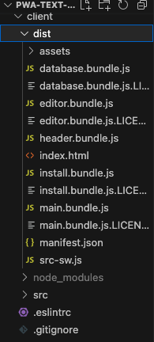
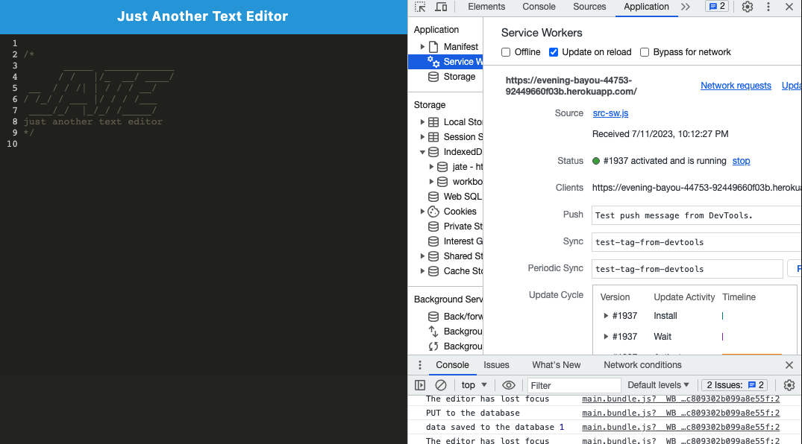
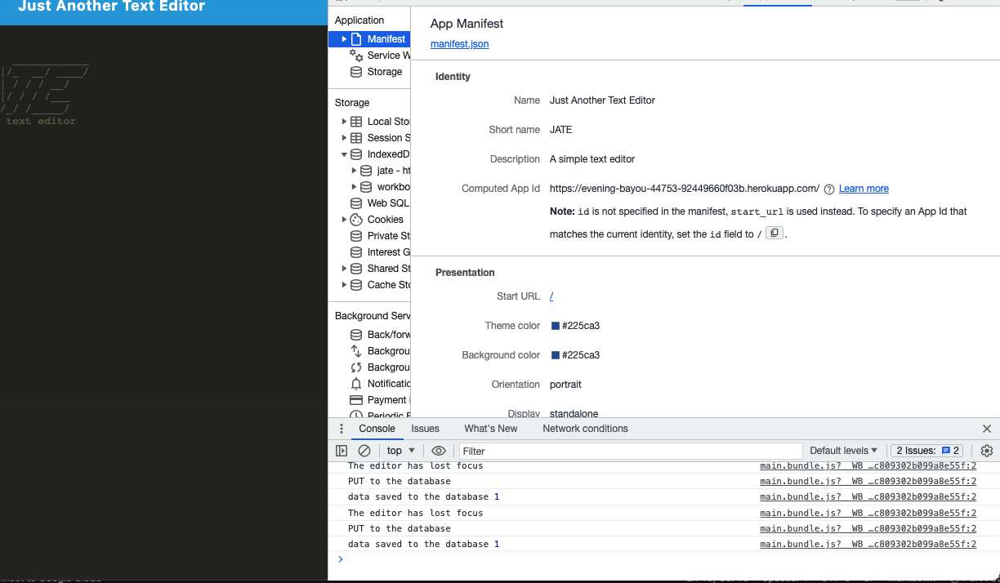

# PWA-text-editor

## Description

This application is a web text editor that allows users to create notes, memos, code snippets, and more without the requirement of a network connection. This application also stores
these notes into a database so that they can be retreived at another time. Integrating a service worker and Cache API's ensure that the application will retain complete functionality with or without internet connection.

## Table of Contents

- [Installation](#installation)
- [Usage](#usage)
- [Deployment](#deployment-link)
- [License](#license)

## Installation

- This application can be installed through Node using a number of npm packages.
- Here is a list of the included npm packages involved in creating/installing this application.
  * npm install express (express.js)
  * npm install --save-dev webpack (Webpack)
  * npm install webpack-dev-server --save-dev (webpack-dev-server)
  * npm install --save-dev webpack-pwa-manifest (WebpackPwaManifest)
  * npm install babel (Babel)
  * npm install --save-dev css-loader (CSS-loader)
  * npm install concurrently --save (run multiple commands concurrently.) (Concurrently)
  * npm npm install idb (IndexedDB)

## Usage

GIVEN a text editor web application, 
WHEN I open my application in my editor
THEN I should see a client server folder structure

    WHEN I run `npm run start` from the root directory
    THEN I find that my application should start up the backend and serve the client
    WHEN I run the text editor application from my terminal
    THEN I find that my JavaScript files have been bundled using webpack
    WHEN I run my webpack plugins
    THEN I find that I have a generated HTML file, service worker, and a manifest file

- 

- 

- 

## Deployment Link
Find this application deployed live at https://evening-bayou-44753-92449660f03b.herokuapp.com/

## License

MIT licensing information can be found in the LICENSE file associated with this repository.